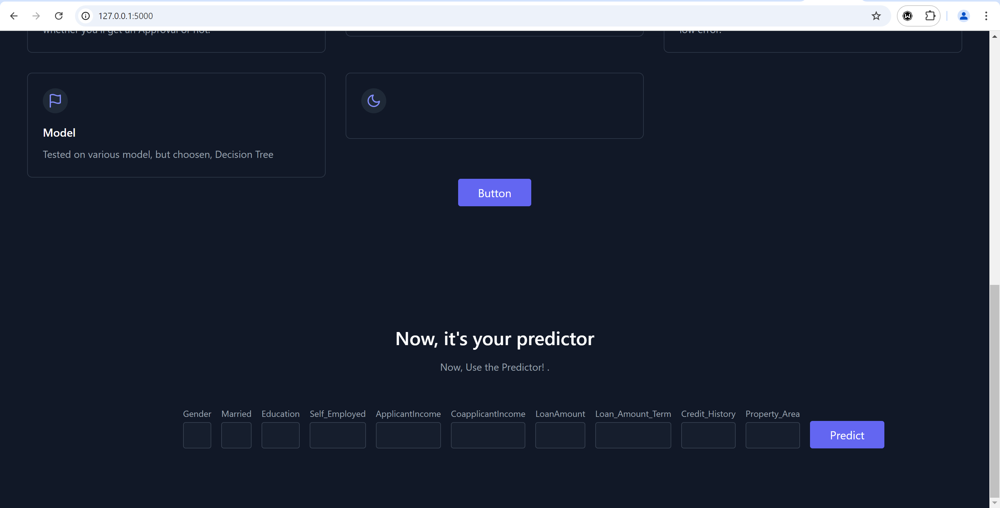

# Loan Approval Model



This project involves building a machine learning model to predict loan approval based on various features. After developing the model, it is saved using Python's `joblib` library, and then deployed using a Flask web application. The web interface allows users to input specific features and receive predictions on loan approval.

## Project Structure

- **datasets/**: Directory containing the dataset(s) used for training the model.
- - **templates/**:
  - **index.html**: The home page of the web application.
  - **layout.html**: This is the base template for your Flask application. It includes Bootstrap for styling and defines a block for content that other templates can fill in.
  - **predict.html**: This template extends layout.html and is used to display the prediction result. It checks the value of prediction and displays "Yes" if the loan is likely to be approved, or "No" otherwise.
- **app.py**: Flask application that serves the model and handles web requests.
- **loan.ipynb**: Jupyter Notebook containing the data exploration, preprocessing, model building, and evaluation.
- **model.pkl**: The serialized machine learning model saved using `joblib`.
- **requirements.txt**: A list of Python dependencies required to run the project.
- **utils.py**: Utility functions used throughout the project.


## Steps to Build and Deploy the Model

### 1. Data Preparation and Model Building

- The dataset is loaded from the `datasets/` directory and explored to understand the features and their impact on loan approval.
- Data preprocessing is performed, including handling missing values, encoding categorical features, and splitting the data into training and testing sets.
- Different machine learning modelling techniques are used to build the model and evaluated on the test set.
- The trained model is serialized and saved as `model.pkl` using the `joblib` library:

    ```python
    import joblib
    joblib.dump(model, "model.pkl")
    ```

### 2. Flask Application for Deployment

- The Flask application (`app.py`) is set up to load the saved model and provide a web interface for predictions:

    ```python
    model = joblib.load('model.pkl')
    ```

- Users can visit the web application, enter values for specific features such as income, credit history, loan amount, etc., and submit the form.
- The model processes the input and returns a prediction, indicating whether the loan is likely to be approved.

### 3. Running the Application

To run the Flask application locally, follow these steps:

1. **Install Dependencies**: Make sure to install the required Python packages using `pip`:

    ```bash
    pip install -r requirements.txt
    ```

2. **Run the Flask App**: Navigate to the project directory and run the Flask application:

    ```bash
    python app.py
    ```

    The application will be accessible at `http://127.0.0.1:5000/` in your web browser.

3. **Interact with the Model**: Use the web interface to input features and get predictions on loan approval.

## File Descriptions

- **app.py**: Python script for the Flask web server that loads the trained model and handles incoming requests.
- **datasets/**: Directory containing the dataset(s) used for training the model.
- **model.pkl**: The trained model saved as a serialized file using `joblib`.
- **requirements.txt**: File listing all dependencies required to run the Flask application.
- **loan.ipynb**: Contains the data analysis, model training, and evaluation steps.
- **utils.py**: Utility functions that support various tasks in the project.
- **templates/**:
  - **index.html**: Home page template for the web application.
  - **layout.html**: Base layout for the web pages.
  - **predict.html**: Template for the prediction page where users input their data.
